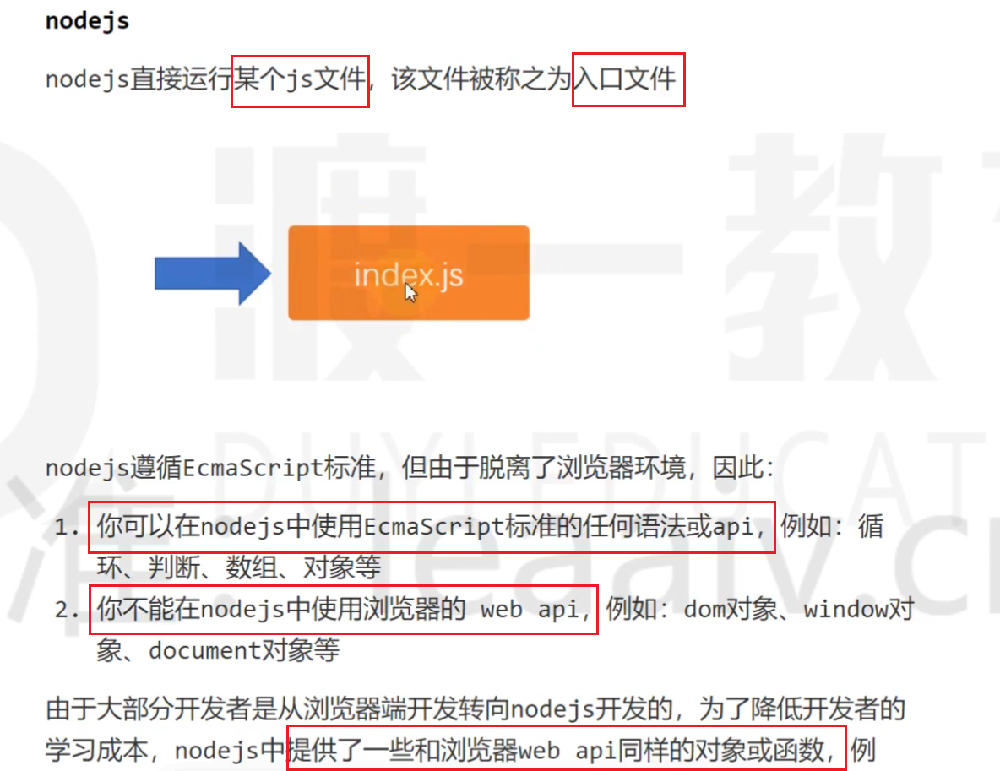
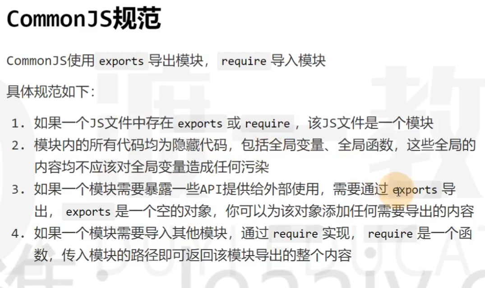
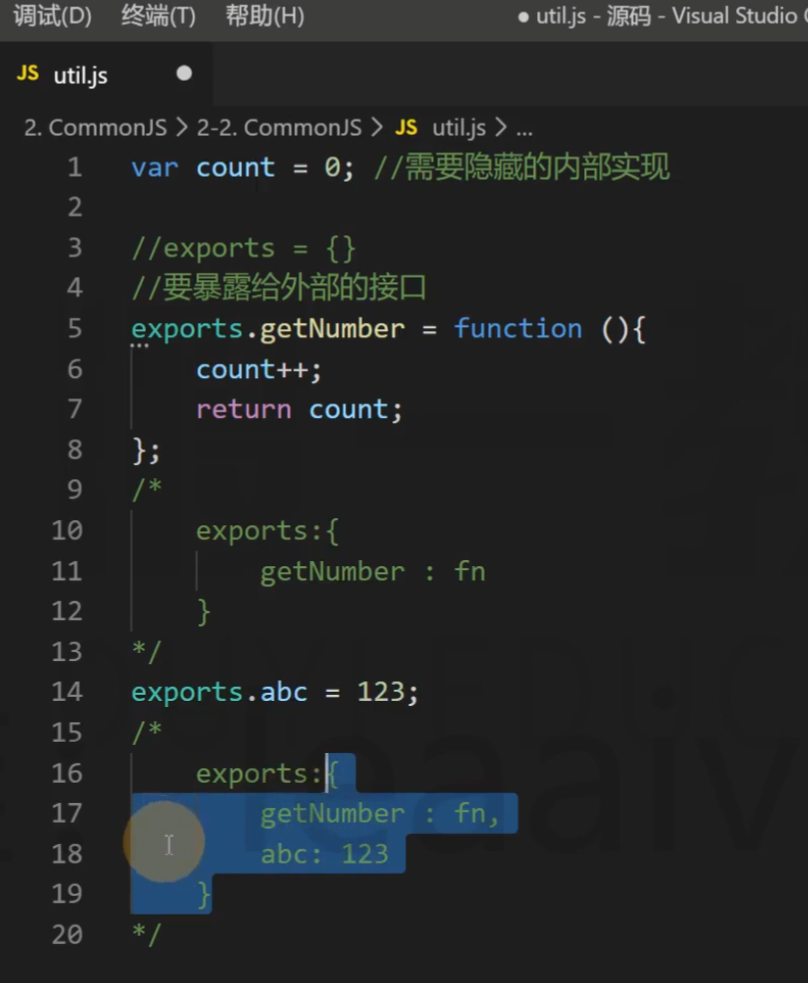
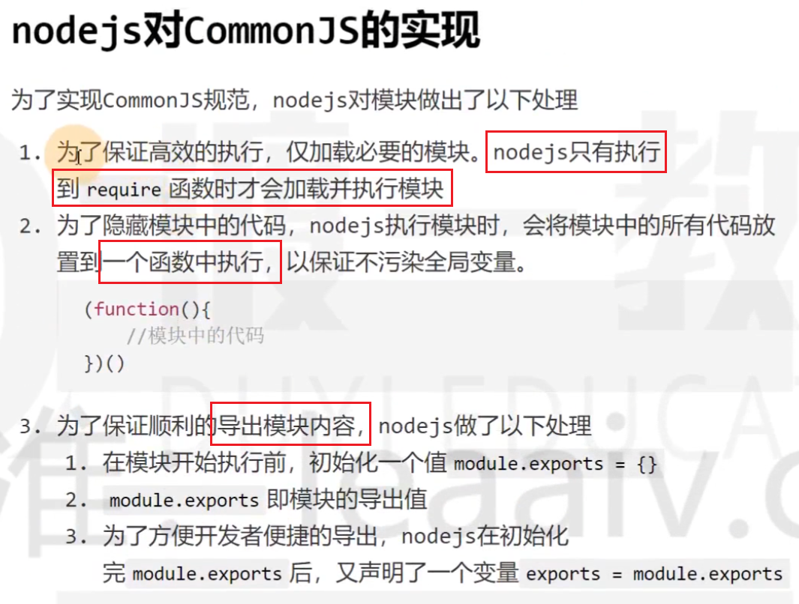
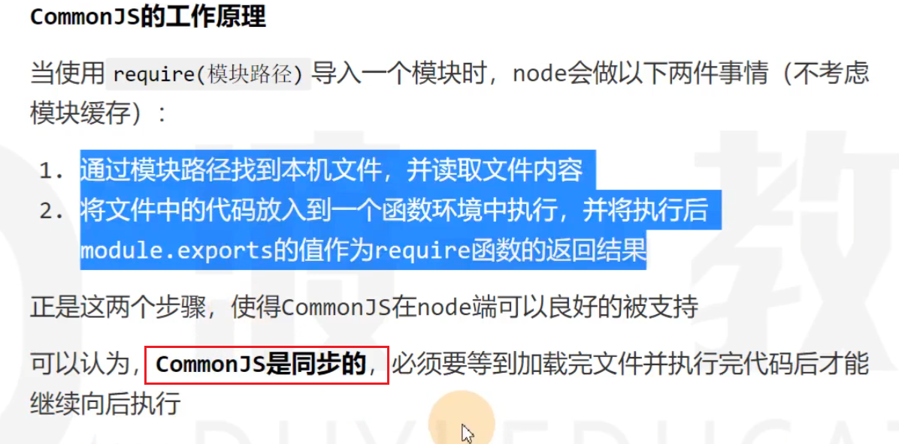
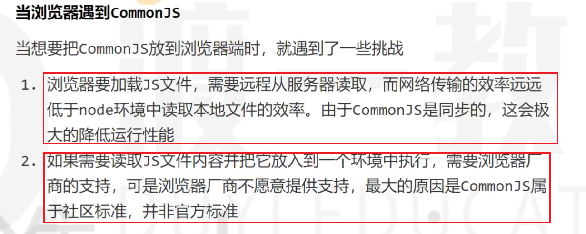
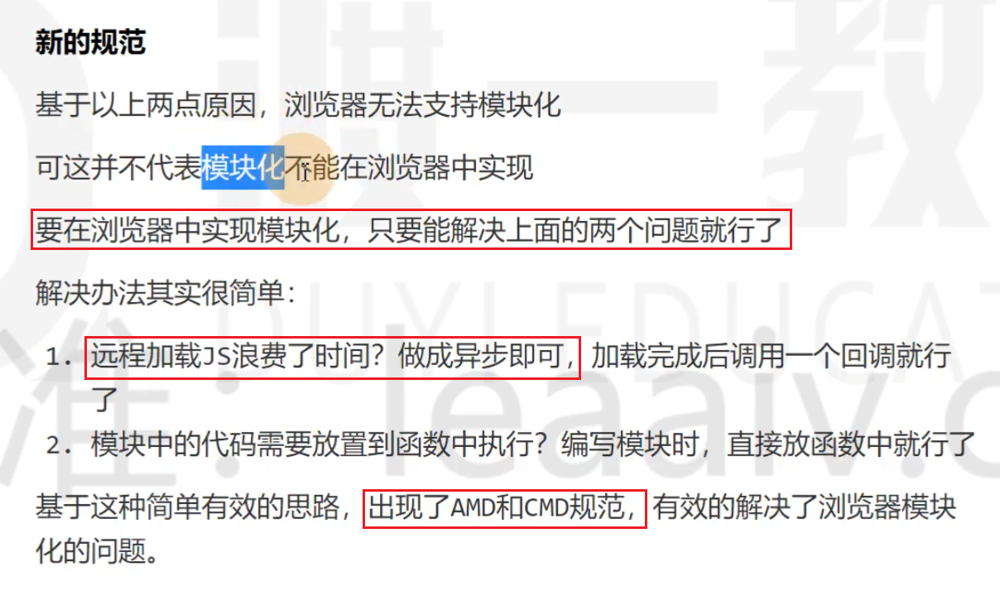

# 安装nodejs
* 如何安装nodejs、nodejs与浏览器的区别
    
* 模块化的概念
    
* commonjs(导入与导出)
    
    
    * 注意：nodejs环境中导入模块，要使用相对路径，并且必须以./ or ../开头，否则报错
    * nodejs对commonjs的实现（原理）
        * **commonjs是同步的，而不是异步的。**必须要等到加载完文件并执行完代码后才能继续向后执行；commonjs只是在nodejs中的模块化规范，并不适用在浏览器中。 
        * 导出原理图示：
            
            补充：为了避免反复加载同一个模块，node.js默认开启了模块缓存，如果加载的模块已经被加载过了，则会自动使用之前的导出结果
        * 执行导出模块原理代码解释：
        ```
            (function(module){          //立即执行函数用于隐藏，防止污染全局变量
                module.exports = {};        //exports为module对象自带的属性，现在这个属性指向一个空对象
                var exports = module.exports;          //新定义一个变量exports，也指向那个空对象，因此给exports添加属性就是给module.exports添加属性
                
                ......                        //模块中的代码
                
                return module.exports         //注意导出的不是exports，而是module.exports，如果exports和module.exports被赋值不指向同一个对象，则exports导出的东西失效

            })
        ```

* 浏览器端模块化的难题
    * 先回顾commonjs的工作原理
        
    * 浏览器基于commonjs的工作原理会遇到的问题
        
        注意：node是在本机读取js文件，而浏览器需要去远程服务器读取js文件。
    * 对于上述问题社区的解决办法
        

